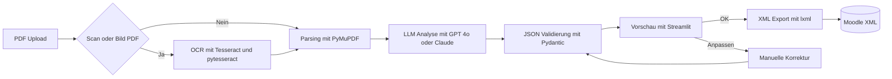

# Tool-Empfehlungen pro Workflow-Schritt

Dieses Dokument konkretisiert den empfohlenen Tool-Stack fuer die Phase-1-Pipeline der PDF-zu-Moodle-Konvertierung.

## Zielsetzung

Die Werkzeugauswahl folgt drei Leitprinzipien:

- moeglichst hohe Nachvollziehbarkeit
- kontrollierbare Python-Pipeline statt offener Agentik
- fruehe Testbarkeit gegen Ground Truth

## Empfohlener Default-Stack

| Schritt | Aufgabe | Empfehlung | Begruendung |
| --- | --- | --- | --- |
| 1 | OCR-Erkennung | Tesseract plus pytesseract | Open Source, gut integrierbar, fuer Prototyping ausreichend |
| 2 | Parsen | PyMuPDF | schnell, robust, Text- und Bildextraktion aus einem Werkzeug |
| 3 | LLM | direkte API-Calls auf GPT-4o oder Claude | geringe Komplexitaet in Phase 1, gute Struktur- und Klassifikationsleistung |
| 4 | JSON kontrollieren | Pydantic | stark fuer Schema, Validierung und klare Datenmodelle |
| 5 | Vorschau | Streamlit | schneller als eine eigene Web-App, gut fuer Review und Demo |
| 6 | manuelle Mutation | Streamlit-Formulare pro Feld | weniger fehleranfaellig als direkte Roh-JSON-Bearbeitung |
| 7 | Export ins XML | lxml | saubere XML-Erzeugung und gute Kontrolle ueber Struktur und Escaping |

## Architekturdiagramm der Toolchain

## Ergaenzende Werkzeuge nach Bedarf

- OCRmyPDF als Vorverarbeitung bei schlecht gescannten PDFs
- pdfplumber fuer zusaetzliche Layout-Analyse
- DeepDiff fuer Soll-Ist-Vergleiche gegen Ground Truth
- pytest fuer Regressionstests auf Referenzfaellen
- DSPy erst in Phase 2, wenn Evaluation und Orchestrierung wichtiger werden

## Einordnung fuer Phase 1

Diese Kombination ist bewusst konservativ. Sie reduziert technische Komplexitaet und staerkt die methodische Argumentation, weil jeder Schritt separat getestet, nachvollzogen und gegen Referenzmaterial validiert werden kann.
