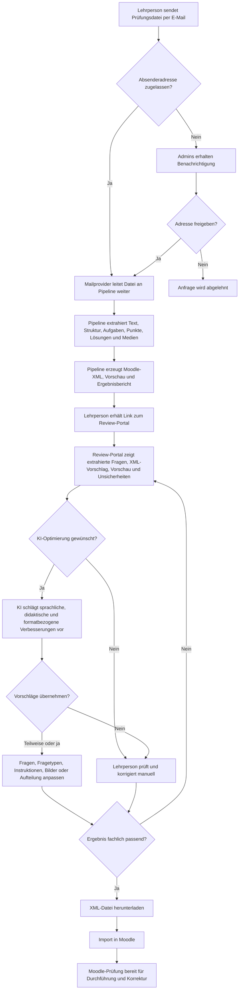

# Zielzustand

## Zweck

Dieses Dokument beschreibt den angestrebten Zielzustand von `dlh-ki-xml`. Im Zentrum steht nicht nur die technische Konvertierung einer Prüfungsdatei in Moodle-XML, sondern ein praxistauglicher Workflow, der Lehrpersonen entlastet, Unsicherheiten sichtbar macht und die fachliche Kontrolle bei der Lehrperson belässt.

## Wunschprozess

1. Die Lehrperson sendet eine E-Mail mit der Prüfungsdatei an `dlh-ki-xml`.
2. Der Mailprovider prüft die Absenderadresse und leitet zugelassene E-Mails automatisch an die Pipeline weiter.
3. Ist die E-Mail-Adresse nicht zugelassen, erhalten die Admins eine Benachrichtigung und können die Adresse manuell freigeben oder ablehnen.
4. Die Pipeline extrahiert Text, Struktur, Aufgaben, Punkte, Lösungshinweise und Medien aus der Quelldatei.
5. Die Lehrperson erhält eine Rückmeldung mit einem Link zum Review-Portal.
6. Im Review-Portal sieht die Lehrperson die extrahierten Fragen, die vorgeschlagene Moodle-XML, eine erste Vorschau der Aufgabe und einen Ergebnisbericht.
7. Die Lehrperson prüft das Resultat, übernimmt sinnvolle Vorschläge und korrigiert unsichere oder fachlich relevante Stellen.
8. Sobald das Ergebnis passt, lädt die Lehrperson die XML-Datei herunter und importiert sie in Moodle.

## KI-gestützte Optimierung im Review

Die KI soll nicht automatisch über die didaktische Endfassung entscheiden. Sie soll Optionen vorschlagen, die von der Lehrperson geprüft und gezielt übernommen werden können.

Mögliche Optimierungen:

- Aufgaben sprachlich präzisieren, vereinfachen oder grammatikalisch korrigieren.
- Die Instruktion passend zum Moodle-Fragetyp formulieren, zum Beispiel für Wahr/Falsch-, Zuordnungs- oder Drag-and-Drop-Aufgaben.
- Einen geeigneteren Fragetyp vorschlagen, etwa statt einer offenen Essay-Frage eine automatisch auswertbare Multiple-Choice- oder Zuordnungsfrage.
- Sichtbar machen, ob eine Aufgabe konvergent und damit eher automatisch korrigierbar ist oder divergent bleibt und durch die Lehrperson beurteilt werden muss.
- Aufgaben mit mehreren Teilschritten in mehrere Moodle-Fragen aufteilen, damit Lernende schrittweise durch die Aufgabe geführt werden.
- Bilder prüfen und bei Bedarf eine lizenzierte Alternative aus Wikimedia Commons vorschlagen, inklusive Quellenangabe.
- Bestehende Abbildungen beibehalten, wenn sie fachlich notwendig oder didaktisch sinnvoll sind.

## Kontextwissen und Personalisierung

Das Review-Portal soll Lehrpersonen erlauben, zusätzliches Kontextwissen zu hinterlegen. Dazu gehören zum Beispiel bevorzugte Formulierungen, Anredeform, fachliche Konventionen, wiederkehrende Prüfungsformate oder schulspezifische Vorgaben.

Dieses Kontextwissen wird gespeichert und bei späteren Prüfungen automatisch berücksichtigt. Dadurch kann die KI-Optimierung stärker auf die Arbeitsweise der einzelnen Lehrperson abgestimmt werden, ohne dass jede Entscheidung wiederholt erklärt werden muss.

## Rollen und Verantwortung

- Die Pipeline erzeugt einen strukturierten, prüfbaren Vorschlag.
- Die KI unterstützt bei sprachlicher, didaktischer und formatbezogener Optimierung.
- Das Review-Portal macht Unsicherheiten, Alternativen und Importbereitschaft sichtbar.
- Die Lehrperson entscheidet, welche Vorschläge übernommen werden.
- Moodle bleibt das Zielsystem für Import, Durchführung und Korrektur.

## Zielbild

Der ideale Prozess führt von der vorhandenen Prüfungsdatei zu einer importierbaren Moodle-XML, ohne dass die Lehrperson technische Details der XML-Struktur verstehen muss. Gleichzeitig bleibt nachvollziehbar, welche Inhalte sicher extrahiert wurden, wo Unsicherheiten bestehen und welche didaktischen Entscheidungen bewusst getroffen werden müssen.

## Prozessdiagramm

## Fazit

Der Zielzustand von `dlh-ki-xml` ist ein kontrollierter Transformations- und Review-Prozess. Die Pipeline soll Arbeit automatisieren, die KI soll sinnvolle Verbesserungen vorschlagen, und die Lehrperson soll schnell, informiert und fachlich souverän entscheiden können.
