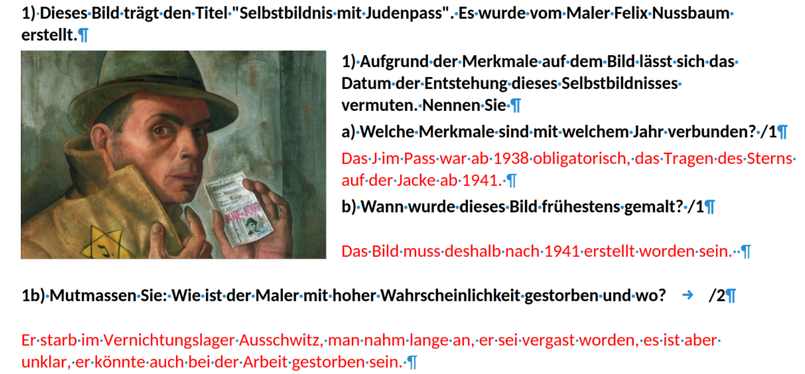
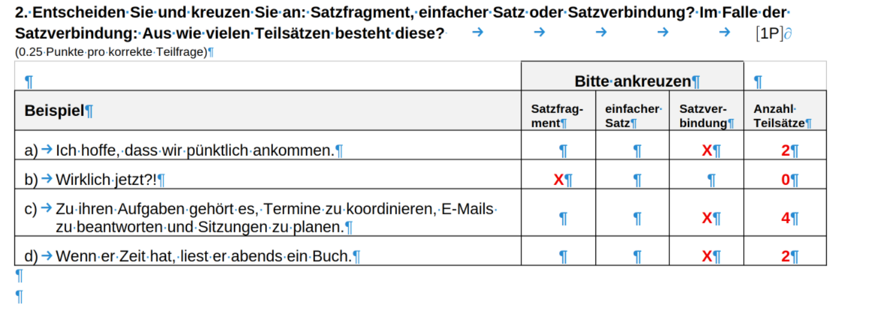
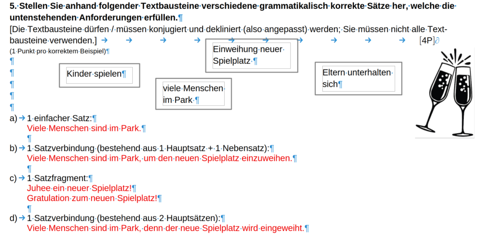
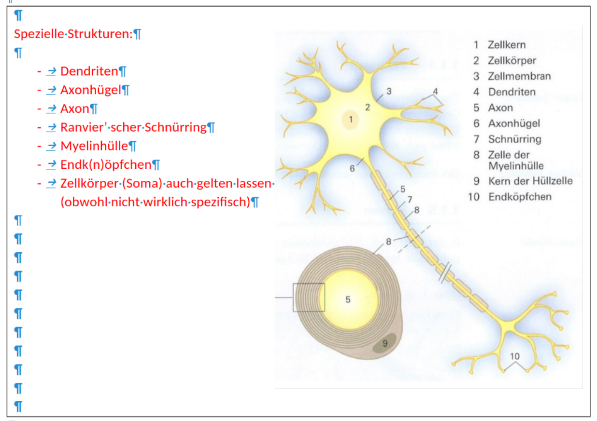

<div class="title-slide">
  <p>
    <a href="https://github.com/dlh-ki-xml" target="_blank">
      
    </a>
  </p>

  <h1>Prüfungen reproduzierbar in Moodle-XML überführen</h1>
  <h5>11. Juni 2026</h5>

  <p>
    <small>
      <a href="mailto:thomas.lampart@students.ffhs.ch">Thomas Lampart | <i class="fas fa-envelope"></i> thomas.lampart@students.ffhs.ch</a><br>
      <a href="https://github.com/dlh-ki-xml" target="_blank"><i class="fab fa-github"></i> github.com/dlh-ki-xml</a>
    </small>
  </p>

  <p class="title-subline" style="font-size: 0.52em;">Prüfungen lokal, prüfbar und reproduzierbar in Moodle-XML überführen.</p>

  <p>
    <a href="https://www.ffhs.ch" target="_blank">
      
    </a>
  </p>
</div>

Note:
[⏱ 1 Min.]<br>
Herzlich willkommen zu meiner Präsentation. Ich möchte Euch unser Projekt vorstellen, bei dem analoge Prüfungen im Handumdrehen in Moodleprüfungen überführt werden können. Ihr habt richtig gehört, mit uns meine ich zwei Kollegen mit denen ich seit anfangs Jahr an diesem Projekt rumstudiere. langfristig soll es über den Kanton teilfinanziert werden.

---

# <i class="fas fa-map-marked-alt"></i> Kontext

<!-- vertical -->

## <i class="fas fa-compass" aria-hidden="true"></i> Worum geht es?

- Schulen investieren in digitale Lernumgebungen wie Moodle.
- Viele Lehrpersonen nutzen diese Systeme noch zurückhaltend.
- Lehrfreiheit und Zeitdruck erschweren den Wechsel zu digitalen Prüfungsprozessen.
- Für Lernende und Institutionen entsteht dadurch ein uneinheitlicher digitaler Prüfungsalltag.
- Das Projekt senkt die Einstiegshürde: bestehende Prüfungen werden kontrolliert nach Moodle überführt.

Note:
[⏱ 0.5 Min.]<br>
Ich starte mit dem Nutzungskontext und der Hürde im Schulalltag.
Wichtig ist der Zielkonflikt: Bildungsinstitutionen investieren in LMS und wünschen mehr digitale Prozesse, während ein Teil der Lehrpersonen unter Zeitdruck andere Prioritäten setzt oder Moodle nur zurückhaltend nutzt.
Das Projekt setzt genau an dieser Reibung an: Es macht den Einstieg über vorhandene Prüfungen einfacher.

<!-- vertical -->

## <i class="fa fa-flag-checkered" aria-hidden="true"></i> Was wäre anzustreben?

<div class="two-col">
<div class="panel">
<h3><i class="fas fa-user"></i> Für Lernende</h3>
<ul>
<li>zeitgemässe Prüfungskultur</li>
<li>klarere Aufgabenformate</li>
<li>weniger Missverständnisse bei der Bearbeitung von Aufgaben</li>
<li>schnellere Rückmeldungen bei geeigneten Fragetypen</li>
</ul>
</div>
<div class="panel">
<h3><i class="fas fa-chalkboard-teacher"></i> Für Lehrpersonen und Institutionen</h3>
<ul>
<li>niederschwelliger Einstieg ins digitale Prüfen</li>
<li>mehr LMS-Nutzung durch konkreten Alltagsnutzen</li>
<li>nachvollziehbare und wiederholbare Prüfungsprozesse</li>
</ul>
</div>
</div>
<div class="quote-box" style="margin-top: 0.8rem;">
<blockquote>
<strong>Zielbild</strong><br>
Digitale Prüfungen sollen verständlicher, machbarer und institutionell skalierbar werden.
</blockquote>
</div>

Note:
[⏱ 0.5 Min.]<br>
Hier formuliere ich den Zielzustand für drei Ebenen.
Relevant ist nicht bloss ein Importformat, sondern ein Prozess, der Akzeptanz, Qualität und Skalierung gleichzeitig verbessert.

<!-- vertical -->

<h2 class="r-fit-text"> <i class="fas fa-chalkboard-teacher"></i> Was soll der ganz konkrete Nutzen für Lehrpersonen sein?</h2>

<div class="two-col">
  <div class="panel">
    <h3>Direkter Nutzen</h3>
    <ul>
      <li>bestehende Prüfungen einfach digitalisieren, statt umständlich zu erfassen</li>
      <li>Moodle-XML nutzen, ohne XML-Details kennen zu müssen</li>
      <li>Unsicherheiten und didaktische Kontrolle über Review-Hinweise selber steuern (Teacher in the Loop)</li>
      <li>RAC </li>
    </ul>
  </div>
  <div class="panel">
    <h3><i class="fas fa-lightbulb"></i> Nudge und Anschlussfähigkeit</h3>
    <ul>
      <li>vorhandene Prüfungen werden zum Einstiegspunkt</li>
      <li>der Nutzen entsteht sofort im Arbeitsalltag</li>
      <li>JSON dient als prüfbarer Stabilitätsanker</li>
      <li>Konvertierbar in weitere Formate (z.B. für ILIAS)</li>
    </ul>
  </div>
</div>
<div class="quote-box" style="margin-top: 0.8rem;">
  <blockquote>
    Das Projekt senkt die Einstiegshürde: Aus vorhandenen Prüfungen entstehen schneller didaktisierte digitale Prüfungen.
  </blockquote>
</div>

Note:
[⏱ 1 Min.]<br>
Hier steht der Lehrpersonen-Nutzen im Zentrum, aber nicht isoliert.
Die Digitalisierung einer bestehenden Prüfung ist der konkrete Einstieg, über den digitales Prüfen überhaupt attraktiv wird.
Das JSON-Zwischenformat ist wichtig, weil der Prozess damit nicht auf ein einziges Zielformat festgelegt ist: Moodle-XML ist der konkrete Export, ILIAS oder weitere LMS bleiben anschlussfähig.

---

# <i class="fas fa-route"></i> Vorgehen

<!-- vertical -->

## <i class="fas fa-cogs"></i> Wie wird das methodisch erreicht?

<div class="mermaid"><pre>
flowchart LR
  A[Quelldatei<br/>PDF oder DOCX] --> B[Extraktion<br/>Text und Struktur]
  B --> C[Normalisierung<br/>neutrales JSON]
  C --> D[Validierung<br/>Schema und Quality Gate]
  D --> E[Export<br/>Moodle-XML]
  E --> F[Report<br/>prüfbare Ergebnisse]
</pre></div>

<div class="two-col" style="margin-top: 0.9rem;">
  <div class="panel">
    <h3><i class="fas fa-sitemap"></i> Technisches Prinzip</h3>
    <ul>
      <li>keine direkte Blackbox-Konvertierung</li>
      <li>jede Stufe erzeugt prüfbare Zwischenergebnisse</li>
      <li>Quality Gate markiert Unsicherheiten vor dem Export</li>
    </ul>
  </div>
  <div class="quote-box">
    <h3><i class="fas fa-lightbulb"></i> Kernidee</h3>
    Die Pipeline trennt Extraktion, Interpretation, Prüfung und Export. Dadurch bleibt der Prozess nachvollziehbar und korrigierbar.
  </div>
</div>

Note:
[⏱ 1 Min.]<br>
Hier beginne ich die Methode.
Die Kernaussage ist: Weil die Quellen mehrdeutig sind, braucht es keinen einfachen Exporter, sondern einen kontrollierten Transformationsprozess.

<!-- vertical -->

## <i class="fas fa-puzzle-piece"></i> Warum ist PDF/DOCX-Parsing anspruchsvoll?

<div class="two-col" style="grid-template-columns: 0.82fr 1.18fr;">
  <div class="panel">
    <h3>Die Datei ist nicht die Bedeutung</h3>
    <ul>
      <li>Layout, Farben und Abstände tragen fachliche Information</li>
      <li>Lösungen können visuell markiert statt textlich ausgezeichnet sein</li>
      <li>Tabellen und Bildaufgaben verlieren beim reinen Textauszug Struktur</li>
      <li>derselbe Inhalt kann mehrere sinnvolle Moodle-Fragetypen ergeben</li>
    </ul>
  </div>
  <div>
    <div class="r-stack" style="height: 430px;">
      <div class="fragment fade-out" data-fragment-index="0" style="text-align: center;">
        
        <p class="tiny">Lösungssignale über Farbe statt Struktur</p>
      </div>
      <div class="fragment current-visible" data-fragment-index="0" style="text-align: center;">
        
        <p class="tiny">Tabellen müssen semantisch rekonstruiert werden</p>
      </div>
      <div class="fragment current-visible" data-fragment-index="1" style="text-align: center;">
        
        <p class="tiny">Dekorative und fachlich relevante Bilder unterscheiden</p>
      </div>
      <div class="fragment current-visible" data-fragment-index="2" style="text-align: center;">
        
        <p class="tiny">Aus einer Vorlage entstehen unterschiedliche digitale Fragetypen</p>
      </div>
    </div>
  </div>
</div>

Note:
[⏱ 1 Min.]<br>
Ich nutze die Bilder als gestapelte Beispiele.
Die Botschaft: Die Pipeline muss nicht nur Text lesen, sondern Layout, visuelle Hinweise, Tabellen, Bilder und didaktische Absicht interpretieren.

<!-- vertical -->

## <i class="fas fa-project-diagram"></i> Einbettung: Python-Pipeline als Kernbaustein

<div class="mermaid"><pre>
flowchart LR
  A[Mail-Intake<br/>PDF oder DOCX] --> B[Python-Pipeline<br/>Extract bis Report]
  B --> C[neutrales JSON<br/>prüfbare Struktur]
  C --> D[agentische KI<br/>Interpretation, Optimierung, Rückfragen]
  D --> E[Review-Portal<br/>Lehrperson prüft und entscheidet]
  E --> F[Moodle-XML<br/>Import in Moodle]
</pre></div>

<div class="two-col" style="margin-top: 0.9rem;">
  <div class="panel">
    <h3>Heute optimiert</h3>
    <ul>
      <li>lokaler Python-Workflow</li>
      <li>neutrales JSON-Zwischenformat</li>
      <li>Validierung, Quality Gate und Moodle-XML-Export</li>
    </ul>
  </div>
  <div class="panel">
    <h3>Später ergänzt</h3>
    <ul>
      <li>E-Mail-Intake und Antwortpfad</li>
      <li>agentische KI-Loops für Interpretation und Optimierung</li>
      <li>Review-Portal mit Freigabe durch die Lehrperson</li>
    </ul>
  </div>
</div>

Note:
[⏱ 1 Min.]<br>
Diese Folie ordnet den aktuellen Python-Workflow ins Gesamtprojekt ein.
Der heutige Stand ist der robuste Transformationskern; spätere Komponenten erweitern ihn um Intake, agentische Interpretation, Rückfragen und Review.

<!-- vertical -->

## <i class="fas fa-user-check"></i> Zielzustand: kontrollierter Review-Prozess

<div class="mermaid"><pre>
flowchart LR
  A[Prüfung<br/>per E-Mail] --> B{zugelassen?}
  B -->|ja| C[Pipeline<br/>extrahiert und strukturiert]
  B -->|nein| D[Admin<br/>Freigabe]
  D --> C
  C --> E[Review-Portal<br/>Fragen, XML, Vorschau, Bericht]
  E --> F{KI-Optimierung<br/>gewünscht?}
  F -->|ja| G[Vorschläge<br/>Sprache, Fragetyp, Bilder]
  F -->|nein| H[manuelle Prüfung]
  G --> I{Lehrperson<br/>übernimmt?}
  H --> J{fachlich passend?}
  I --> J
  J -->|nein| E
  J -->|ja| K[Moodle-XML<br/>downloaden und importieren]
</pre></div>

<div class="quote-box" style="margin-top: 0.8rem;">
  <strong>Prinzip</strong><br>
  Die Pipeline automatisiert den Transfer. Die KI schlägt Verbesserungen vor. Die Lehrperson entscheidet.
</div>

Note:
[⏱ 1 Min.]<br>
Diese Folie zeigt den langfristigen Zielzustand.
Wichtig ist die Review-Schleife: Unsichere oder didaktisch offene Punkte gehen zurück ins Portal, nicht ungeprüft nach Moodle.

---

# <i class="fas fa-chart-line"></i> Resultate

Note:
[⏱ 0.25 Min.]<br>
Ab hier zeige ich, was aus dem Vorgehen konkret entstanden ist.

<!-- vertical -->

## <i class="fas fa-layer-group"></i> Resultat 1: prüfbarer Transformationskern

<div class="mermaid"><pre>
flowchart LR
  A[Input<br/>PDF oder DOCX] --> B[extract<br/>Rohtext und Metadaten]
  B --> C[normalize<br/>KI stützt Struktur und Fragetyp]
  C --> D[validate<br/>Schema plus Quality Gate]
  D --> E[export<br/>Moodle-XML]
  E --> F[report<br/>Summary und Prüfergebnisse]
</pre></div>

<div class="two-col" style="margin-top: 0.8rem;">
  <div class="panel">
    <h4>Was steht heute?</h4>
    <ul>
      <li>lokale Python-Pipeline mit festen Stages</li>
      <li>neutrales JSON als prüfbares Zwischenformat</li>
      <li>Moodle-XML-Export mit Report pro Lauf</li>
    </ul>
  </div>
  <div class="panel">
    <h4>Warum ist das belastbar?</h4>
    <ul>
      <li>jeder Schritt bleibt lokal nachvollziehbar</li>
      <li>Quality Gate stoppt oder markiert unsichere Fälle</li>
      <li>Export bleibt deterministisch statt KI-Direktausgabe</li>
    </ul>
  </div>
</div>

Note:
[⏱ 1 Min.]<br>
Kernaussage: Das erste Resultat ist kein fertiges Produktivsystem, sondern ein robuster Transformationskern.
Wichtig ist die Prüfbarkeit pro Stufe.

<!-- vertical -->

## <i class="fas fa-vial"></i> Resultat 2: an drei Prüfungen kalibriert

| Prüfung             | Fokus                                    | Ergebnis                                        |
| ------------------- | ---------------------------------------- | ----------------------------------------------- |
| Geschichtsprüfung 1 | Fragetyp, Punkte, Segmentierung          | Phase-1-Eval: `total_score = 1.0000`            |
| Geschichtsprüfung 2 | Generalisierung auf zweite reale Prüfung | Struktur und Typverteilung entsprechen Referenz |
| Deutschprüfung      | AUF/LSG-Logik und PDF-/DOCX-Verarbeitung | Aufgabenfassung und Lösungshinweise trennbar    |

<div class="two-col" style="margin-top: 0.7rem;">
  <div class="panel">
    <h3>Verbessert</h3>
    <ul>
      <li>Confidence-Logik stabilisiert</li>
      <li>AUF und LSG sauberer getrennt</li>
      <li>PDF-Header, Fusszeilen und Trennsilben bereinigt</li>
    </ul>
  </div>
  <div class="panel">
    <h3>Einordnung</h3>
    <ul>
      <li>keine ML-Trainingsphase, sondern regel- und promptbasierte Kalibrierung</li>
      <li>reale Prüfungen statt synthetischer Beispiele</li>
      <li>offene Deltas bleiben im Report sichtbar</li>
    </ul>
  </div>
</div>

Note:
[⏱ 1 Min.]<br>
Ich verwende bewusst Kalibrierung, nicht Training.
Die drei Prüfungen zeigen, dass der Workflow an echten Dokumenten geschärft wurde.

<!-- vertical -->

## <i class="fas fa-balance-scale"></i> Resultat 3: Vergleich gegen KI-Direktexport

<div class="metric-row">
  <div class="metric">
    <span class="value">0.945</span>
    <span class="label">Pipeline-Score gegen Referenz-XML</span>
  </div>
  <div class="metric">
    <span class="value">0.636 / 0.458</span>
    <span class="label">Copilot-Studio Run 1 / Run 2</span>
  </div>
  <div class="metric">
    <span class="value">0/2</span>
    <span class="label">strikt gültige Copilot-XMLs im Test</span>
  </div>
</div>

<div class="two-col" style="margin-top: 0.8rem;">
  <div class="panel">
    <h3>Messpunkt</h3>
    <ul>
      <li>Referenzvergleich für Geschichtsprüfung 1</li>
      <li>bewertet: XML-Validität, Fragen, Typen, Punkte und Textabdeckung</li>
      <li>Report: `xml-reference-comparison.md`</li>
    </ul>
  </div>
  <div class="panel">
    <h3>Aussage</h3>
    <ul>
      <li>Pipeline ist näher an der Referenz</li>
      <li>Copilot-Runs unterscheiden sich deutlich voneinander</li>
      <li>deterministischer Export ist konsistenter und import-sicherer</li>
    </ul>
  </div>
</div>

Note:
[⏱ 1 Min.]<br>
Die Zahl `0/2` bedeutet: Beide Copilot-Studio-Dateien enthielten XML-Syntaxfehler und waren im strikten Sinn nicht wohlgeformt.
Für den Vergleich wurden sie technisch reparierend eingelesen, aber ein Moodle-Import kann an solchen Fehlern scheitern.
Ich formuliere kritisch: Das beweist nicht, dass grosse KI-Modelle fachlich schlechter sind. Es zeigt aber, dass der direkte XML-Export in diesen zwei Runs weniger vorhersehbar und technisch nicht import-sicher war.

---

# <i class="fas fa-terminal"></i> Demo und Ausblick

Note:
[⏱ 0.25 Min.]<br>
Nach den Resultaten folgt der Reproduktionspfad und danach die Einbettung in die weitere Projektentwicklung.

<!-- vertical -->

## Demo-Pfad: reproduzierbarer Ausführungspfad

<div class="two-col">
  <div class="panel">
    <h3>Pipeline-Lauf</h3>
    <video
      src="media/pipeline-demo.mp4"
      autoplay
      muted
      loop
      playsinline
      controls
      onloadedmetadata="this.playbackRate = 2.0"
      onplay="this.playbackRate = 2.0"
      style="width:100%; border-radius:8px; border:1px solid #d7dde5; background:#0d1117;"
    ></video>
  </div>
  <div class="panel">
    <h3>Prüfdateien</h3>
    <pre style="font-size: 0.46em;"><code>Prompt                         Struktur, Fragetyp, Review
01_extract/raw_text.txt         Rohtext
02_normalize/normalized.json    Aufgabenstruktur
03_validate/validation_report   Quality Gate
05_report/summary.md            Kurzstatus</code></pre>
    <h3>Zentrale Libraries</h3>
    <pre style="font-size: 0.46em;"><code>PyMuPDF       PDF-Extraktion
python-docx   DOCX-Extraktion
pydantic      Validierung
lxml          Moodle-XML
pytest        Tests</code></pre>
    <div class="quote-box" style="margin-top: 0.7rem;">
      <strong>Einordnung</strong><br>
      Das Video zeigt, wie eine PDF-Prüfung durch die Pipeline läuft und welche Dateien den Lauf nachvollziehbar machen.
    </div>
  </div>
</div>

Note:
[⏱ 1 Min.]<br>
Diese Folie ist keine Live-Demo, sondern eine aufgezeichnete, reproduzierbare Ausführung.
Die Python-Pipeline ist mit Vibecoding entstanden: Ich habe Anforderungen, Beispiele und Fehlverhalten iterativ mit Codex bearbeitet, Code erzeugt oder angepasst, Tests laufen lassen, Reports geprüft und danach die nächste Verbesserung abgeleitet.
Im Video sieht man den Start im Python-Projekt, die Aktivierung der lokalen Umgebung und den Pipeline-Aufruf als Python-Modul.
Der Lauf erzeugt nacheinander Extraktion, Normalisierung, Validierung, XML-Export, Moodle-Gate, Review-Package und Summary.
Die rechte Seite zeigt, wo ich nach dem Lauf prüfe: Rohtext, normalisiertes JSON, Validierungsbericht und Kurzreport.

<!-- vertical -->

## <i class="fas fa-brain"></i> Ausblick: Python-Backbone mit KI-Workflow-Logik

<div class="two-col">
  <div class="panel">
    <h3>Backbone von mir</h3>
    <ul>
      <li>operativer Backbone</li>
      <li>lokale Tests und deterministische Prüfergebnisse</li>
      <li>Nachvollziehbarkeit pro Stage</li>
    </ul>
  </div>
  <div class="panel">
    <h3>Workflow von Martin</h3>
    <ul>
      <li>E-Mail-Intake und Rückfragepfad</li>
      <li>agentische KI-Loops für Interpretation, didaktischeOptimierung und Rückfragen</li>
      <li>neutrales Zwischenformat (JSON) und Entscheidungslogik</li>
    </ul>
  </div>
</div>

<div class="quote-box" style="margin-top: 0.8rem;">
  <strong>Strategische Richtung</strong><br>
  Python-Pipeline als Ausführungs-Backbone behalten und die fachliche Qualitätslogik des KI-Workflow schrittweise integrieren.
</div>

Note:
[⏱ 1 Min.]<br>
Der Ausblick ist bewusst kein Entweder-oder.
Die Kombination ist stark: technische Reproduzierbarkeit von thomtomi plus fachlicher Produktfluss von mmaritini.

---

# <i class="fas fa-check-circle"></i> Abschluss

Note:
[⏱ 0.25 Min.]<br>
Ich leite zur Schlussfolgerung über.

<!-- vertical -->

## <i class="fas fa-clipboard-check"></i> Fazit

- Prüfungen einfach digitalisiert und didaktisch optimiert statt umständlich manuell zu erfassen
- robuste und deterministische Python-Pipeline mit prüfbaren Stages als technischer Backbone
- KI-gestützte Interpretation, Qualitätsprüfung und Optimierung mit «Teacher in the Loop»
- Qualitätsstufe `ready` für Geschichtsprüfung sowie Grammatik AUF in DOCX und PDF erreicht
- ROI-Potenzial: ca. 0.5-1.0 h Pipeline und KI-Review statt ca. 6-8 h manueller Moodle-Erfassung
- Nächster Schritt: Prompt-Dokumentation konsolidieren und KI-Workflow-Logik kontrolliert integrieren

<p class="lead">Der Anhang dokumentiert Reproduktionsschritte, Architekturdetails und belegte Run-Ergebnisse.</p>

Note:
[⏱ 0.5 Min.]<br>
Ich schliesse mit den Kernaussagen und verweise kurz auf den Anhang.
Der ROI ist bewusst als realistische Grössenordnung formuliert: Eine Prüfung durch Pipeline und anschliessende KI-Optimierung dürfte später etwa 0.5 bis 1.0 Stunden benötigen.
Eine manuelle Erfassung in Moodle kann gut 6 bis 8 Stunden beanspruchen.
Wichtig ist der qualitative Unterschied: Bei der manuellen Erfassung ist die Prüfung danach zwar in Moodle, aber noch nicht automatisch auf die Didaktik von Online-Prüfungen angepasst.

<!-- vertical -->

<h2 class="r-fit-text"><i class="fas fa-heart" aria-hidden="true"></i> Danke für Eure Aufmerksamkeit!</h2>
<p>Ich freue mich über Kritik und Anregungen!</p>
<div style="text-align: center; margin-top: 1.5rem; margin-bottom: 2rem;">
<span style="font-size: 120px; color: #133a61;">
  <i class="fas fa-comment-dots"></i>
</span>
</div>

<div style="position:absolute; left:0; right:0; bottom:8px; display:flex; justify-content:space-between; align-items:flex-end; padding:0 40px; font-size:small;">
  <div style="text-align:left;">
    <a href="mailto:thomas.lampart@students.ffhs.ch">
      <br>
      <i class="fas fa-envelope"></i> thomas.lampart@students.ffhs.ch
    </a>
  </div>
  <div style="text-align:center;">
    <a href="https://dlh-ki-xml.github.io/project-slides/GenKI2-SemA-final/index.html">
      <i class="fas fa-external-link-alt" aria-hidden="true"></i> slides
    </a><br>
    <a href="https://github.com/dlh-ki-xml/project-slides">project-slides</a><br>
    <a href="https://github.com/dlh-ki-xml/project-docs">project-docs</a><br>
    <a href="mailto:dlh-ki-xml@svc-ai.fyi">
      <i class="fas fa-paper-plane"></i> Workflow: dlh-ki-xml@svc-ai.fyi
    </a>
  </div>
  <div style="text-align:right;">
    <a href="https://github.com/dlh-ki-xml">
      <br>
      <i class="fab fa-github"></i> repositories
    </a>
  </div>
</div>

Note:
[⏱ 0.5 Min.]<br>
Diese Folie ist der eigentliche Abschluss des Hauptteils.
Die QR-Codes und Links führen zu E-Mail, Präsentation und den GitHub-Repositories der Projektorganisation.
Die Adresse `dlh-ki-xml@svc-ai.fyi` ist der Workflow-Einstieg: Dort kann eine Prüfungsdatei an den angebundenen Prozess geschickt werden.

---

<span class="appendix-tag">Anhang</span>

## Anhang: Inhaltsverzeichnis

<div class="two-col">
  <div class="panel">
    <h3>Reproduktion</h3>
    <ul>
      <li><a href="#/7/1">A: Repo-Struktur für Wiederholung</a></li>
      <li><a href="#/7/2">B: Minimaler Reproduktionsablauf</a></li>
      <li><a href="#/7/3">C: Was wurde iterativ verbessert?</a></li>
      <li><a href="#/7/4">D: Belegte Run-Ergebnisse</a></li>
      <li><a href="#/7/5">E: Zielarchitektur der Kombination</a></li>
    </ul>
  </div>
  <div class="panel">
    <h3>Hintergrund zur Pipeline</h3>
    <ul>
      <li><a href="#/8/1">F: Module und Verantwortlichkeiten</a></li>
      <li><a href="#/8/2">G: Zwischenformat und Quality Gate</a></li>
      <li><a href="#/8/3">H: Python-Libraries</a></li>
      <li><a href="#/8/4">I: Evaluation und Vergleichsreports</a></li>
      <li><a href="#/8/5">J: Vibecoding-Workflow</a></li>
    </ul>
  </div>
</div>

Note:
Dies ist die klickbare Übersicht für den Anhang.
Die Links springen direkt zu den jeweiligen Backup-Folien.

---

## Reproduktion

<!-- vertical -->

## Anhang A: Repo-Struktur für Wiederholung

```text
project-docs/
├── project/python-skripte/
│   ├── data/input_pdfs/
│   ├── data/runs/<exam-id>/
│   ├── src/pdf_to_moodle/
│   └── tests/
└── results/

project-slides/
└── GenKI2-SemA-final/
```

- `src/pdf_to_moodle/` enthält Extraktion, Normalisierung, Validierung und Export.
- `data/runs/` enthält alle Artefakte eines konkreten Laufs.
- `project-slides/` enthält die versionierte Präsentationsdokumentation.

<p class="tiny"><a href="#/6">Zurück zur Anhangsübersicht</a></p>

Note:
Diese Folie zeigt, wo jemand im Repo einsteigen muss, um das Projekt erneut auszuführen.

<!-- vertical -->

## Anhang B: Minimaler Reproduktionsablauf

```bash
cd project-docs/project/python-skripte
source .venv/bin/activate

python -m pytest tests/test_parser.py tests/test_prompt_solution_split.py tests/test_quality_gate.py -q

python -m pdf_to_moodle.main \
  --exam-id deutsch-auf-p16-2026w22 \
  --input data/input_pdfs/AUF-Grammatikpruefung-Syntax-Interpunktion.docx \
  --stage all

python -m pdf_to_moodle.main \
  --exam-id deutsch-auf-p17-pdf-2026w22 \
  --input data/input_pdfs/AUF-Grammatikpruefung-Syntax-Interpunktion.pdf \
  --stage all
```

Erwartung: In beiden Runs enthält `05_report/summary.md` den Status `quality_gate: ready`.

<p class="tiny"><a href="#/6">Zurück zur Anhangsübersicht</a></p>

Note:
Das ist die kompakteste Schrittfolge, um den aktuellen Stand auf einem frischen Checkout zu prüfen.

<!-- vertical -->

## Anhang C: Was wurde iterativ verbessert?

| Iteration        | Problem                                           | Wirkung                                 |
| ---------------- | ------------------------------------------------- | --------------------------------------- |
| Confidence-Fix   | systematisches `needs_review`                     | History-Run auf `ready` gebracht        |
| AUF vs. LSG      | Aufgabenhinweise landeten in `solution_text`      | AUF-Dateien sauberer modelliert         |
| PDF-Cleanup      | Header, Fusszeilen, Trennsilben                   | PDF-Run fachlich näher an DOCX gebracht |
| Prompt-Heuristik | Rubriken und Instruktionen wurden falsch getrennt | längere Aufgabenköpfe stabilisiert      |

<p class="tiny"><a href="#/6">Zurück zur Anhangsübersicht</a></p>

Note:
Diese Folie zeigt die Entwicklungslogik: kein grosser Wurf, sondern mehrere kleine, validierte Iterationen.

<!-- vertical -->

## Anhang D: Belegte Run-Ergebnisse

| Run                           | Ergebnisdatei                        | Zweck                           |
| ----------------------------- | ------------------------------------ | ------------------------------- |
| `history-p14-2026w22`         | `05_report/summary.md`               | Quality Gate und Review-Status  |
| `deutsch-auf-p16-2026w22`     | `02_normalize/normalized.json`       | AUF-DOCX in JSON geprüft        |
| `deutsch-auf-p17-pdf-2026w22` | `01_extract/raw_text.txt`            | PDF-Extraktion sichtbar geprüft |
| `deutsch-auf-p17-pdf-2026w22` | `03_validate/validation_report.json` | finale Bewertung `ready`        |

<p class="tiny"><a href="#/6">Zurück zur Anhangsübersicht</a></p>

Note:
Der Anhang verweist absichtlich auf echte Dateien im Repo.
Damit bleibt die Präsentation an prüfbare Artefakte gekoppelt.

<!-- vertical -->

## Anhang E: Zielarchitektur der Kombination

<div class="mermaid"><pre>
flowchart LR
  intake[E-Mail oder Upload] --> precheck[Attachment Gate]
  precheck --> pipe[Python-Pipeline<br/>extract bis export]
  pipe --> gate[Quality Gate]
  gate -->|ready| xml[Moodle-XML plus Report]
  gate -->|unsicher| clarify[gezielte Rückfrage]
  clarify --> pipe
  gate --> meta[neutrales Zwischenformat]
  meta --> product[KI-Workflow-Logik nach mmaritini]
</pre></div>

- technische Ausführung bleibt deterministisch
- fachliche Entscheidungslogik und Nutzerfluss werden ausgebaut
- beide Stränge zahlen auf denselben Qualitätsstandard ein

<p class="tiny"><a href="#/6">Zurück zur Anhangsübersicht</a></p>

Note:
Das ist die Brücke zwischen heute und dem Ausblick.
Die Kombination bedeutet nicht, die Python-Pipeline zu ersetzen, sondern sie in einen stärkeren Produktfluss einzubetten.

---

## Hintergrund zur Pipeline

<!-- vertical -->

## Anhang F: Module und Verantwortlichkeiten

| Modul                | Verantwortung                                                       |
| -------------------- | ------------------------------------------------------------------- |
| `pipeline.py`        | orchestriert `extract`, `normalize`, `validate`, `export`, `report` |
| `parser.py`          | erkennt Aufgabenstruktur, Punkte, Antwortbereiche und Rubriken      |
| `llm_pipeline.py`    | modelliert KI-gestützte Normalisierung und Review-Hinweise          |
| `json_schema.py`     | definiert das prüfbare Zwischenformat                               |
| `xml_export.py`      | erzeugt Moodle-XML deterministisch aus validiertem JSON             |
| `moodle_gate.py`     | bewertet `ready`, `needs_review`, `blocked`                         |
| `merge_solutions.py` | führt Aufgaben- und Lösungsversion konservativ zusammen             |

<p class="tiny"><a href="#/6">Zurück zur Anhangsübersicht</a></p>

Note:
Diese Folie zeigt die interne Arbeitsteilung.
Wichtig ist: Interpretation, Validierung und Export sind getrennt, damit Fehler lokalisierbar bleiben.

<!-- vertical -->

## Anhang G: Zwischenformat und Quality Gate

<div class="mermaid"><pre>
flowchart LR
  raw[Rohtext] --> normalized[normalized.json]
  normalized --> schema[Schema-Prüfung]
  schema --> gate{Quality Gate}
  gate -->|ready| xml[Moodle-XML]
  gate -->|needs_review| report[Report mit Prüfpunkten]
  gate -->|blocked| stop[kein Export]
</pre></div>

- `normalized.json` ist der Stabilitätsanker zwischen Parsing, KI-Logik und Export.
- Das Quality Gate verhindert, dass unsichere Fälle still als fertiger Import erscheinen.
- Review-Hinweise sind Teil des Outputs, nicht nur interne Fehlermeldungen.

<p class="tiny"><a href="#/6">Zurück zur Anhangsübersicht</a></p>

Note:
Diese Folie erklärt, weshalb die Pipeline nicht direkt von PDF/DOCX nach XML springt.
Das Zwischenformat macht den Prozess nachvollziehbar, testbar und korrigierbar.

<!-- vertical -->

## Anhang H: Python-Libraries

| Library       | Rolle in der Pipeline                                 |
| ------------- | ----------------------------------------------------- |
| `PyMuPDF`     | PDF-Text und PDF-Strukturen extrahieren               |
| `python-docx` | DOCX-Dateien, Absätze und Tabellen auslesen           |
| `pydantic`    | strukturierte Validierung und Fehlerkontrolle         |
| `lxml`        | Moodle-XML erzeugen und XML-Vergleiche auswerten      |
| `pytest`      | Regressionstests für Parser, Quality Gate und Reports |

<div class="quote-box" style="margin-top: 0.8rem;">
  <strong>Prinzip</strong><br>
  Fachliche Interpretation darf KI-gestützt sein; der Export selbst bleibt kontrolliert und deterministisch.
</div>

<p class="tiny"><a href="#/6">Zurück zur Anhangsübersicht</a></p>

Note:
Diese Folie ordnet die technischen Abhängigkeiten ein.
Die Libraries sind bewusst Standardbausteine: Dokumentextraktion, Validierung, XML und Tests.

<!-- vertical -->

## Anhang I: Evaluation und Vergleichsreports

| Report                          | Aussage                                                        |
| ------------------------------- | -------------------------------------------------------------- |
| `accuracy-summary.md`           | verdichtet Phase-1-Cases, Total Score und Quality Gate         |
| `scoring.json`                  | enthält die maschinenlesbaren Case-Ergebnisse                  |
| `comparison-vs-ground-truth.md` | zeigt Abweichungen gegen Referenz-XML                          |
| `xml-reference-comparison.md`   | vergleicht Pipeline und Copilot-Studio gegen dieselbe Referenz |

- Kernmessung: Struktur, Fragetyp, Punkte, Textabdeckung, XML-Validität.
- Die Reports trennen Korrektheit von Importfähigkeit.
- Offene Deltas bleiben sichtbar statt in einem Gesamtscore zu verschwinden.

<p class="tiny"><a href="#/6">Zurück zur Anhangsübersicht</a></p>

Note:
Diese Folie erklärt, wie Resultate belegt werden.
Sie ist wichtig, falls gefragt wird, woher die Scores und Aussagen auf den Resultatfolien stammen.

<!-- vertical -->

## Anhang J: Vibecoding-Workflow

<div class="mermaid"><pre>
flowchart LR
  A[Beispieldokument<br/>und Zielverhalten] --> B[Codex-Iteration<br/>Code, Tests, Doku]
  B --> C[Testlauf<br/>pytest und Pipeline]
  C --> D[Run-Ergebnisse<br/>JSON, XML, Report]
  D --> E[Fehleranalyse<br/>Prompt oder Code schärfen]
  E --> B
</pre></div>

- Anforderungen wurden aus realen Prüfungen und Referenz-XML abgeleitet.
- Codex unterstützte bei Implementierung, Testfällen, Reports und Dokumentation.
- Jede Verbesserung wurde über lokale Tests oder konkrete Run-Ergebnisse überprüft.

<p class="tiny"><a href="#/6">Zurück zur Anhangsübersicht</a></p>

Note:
Diese Folie beschreibt, wie die Python-Pipeline entstanden ist.
Vibecoding bedeutet hier nicht blindes Generieren, sondern iteratives Arbeiten mit Anforderungen, Tests, Fehleranalyse und überprüfbaren Ergebnissen.
